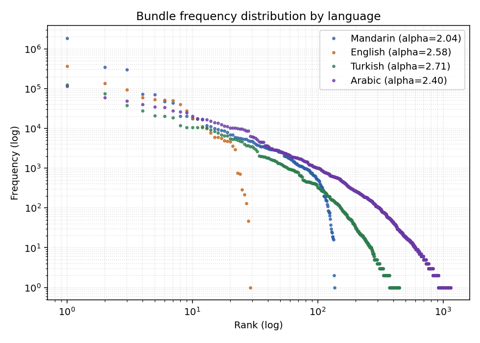
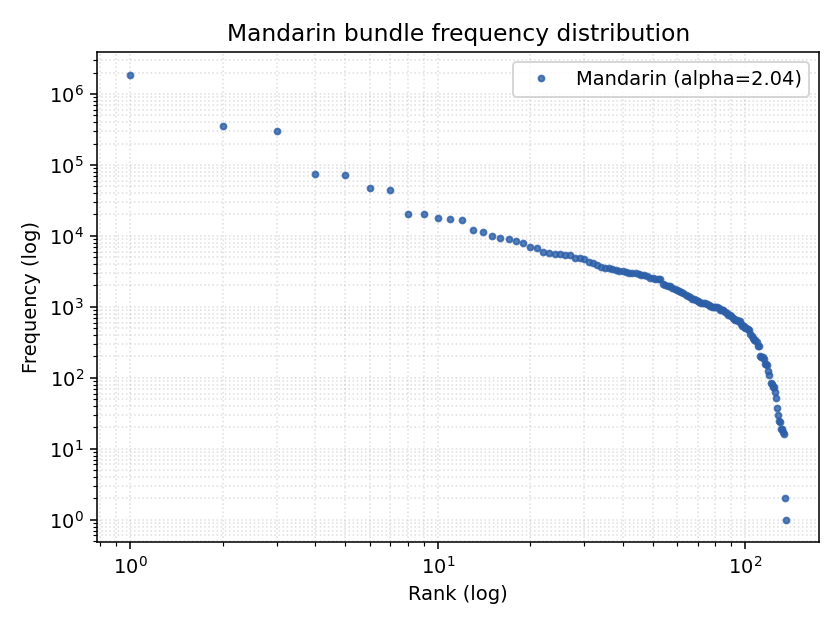
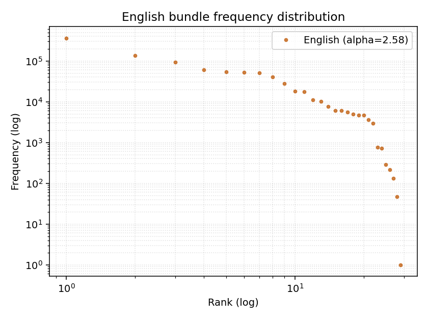
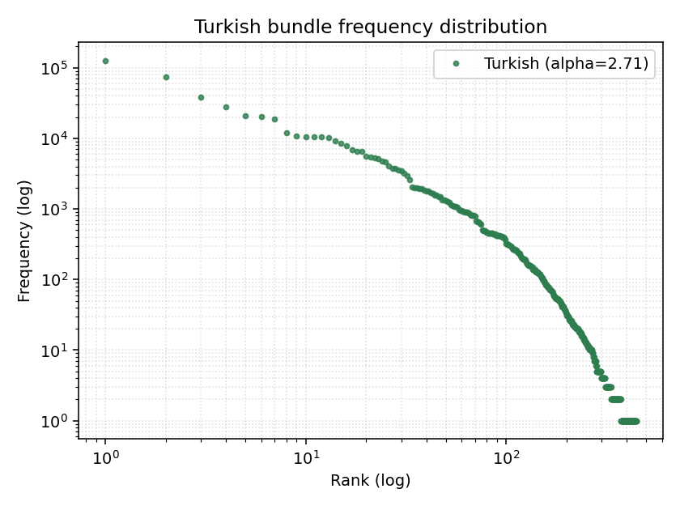
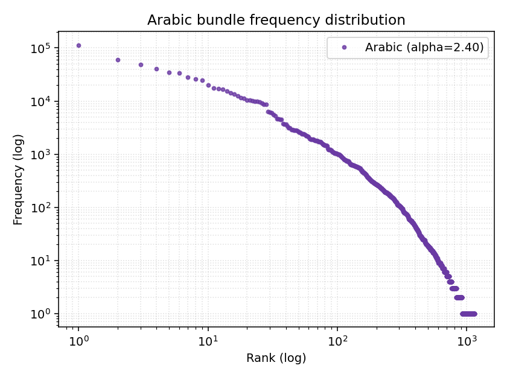

# Bundle distribution report

Corpus: `mini_experiment/data/<lang>_train.txt`, cap 20,000 sentences per language.

## Combined view

## Per-language summary

| Lang | Sentences | Tokens | Unique bundles | Zipf alpha | Verdict |
|---|---:|---:|---:|---:|---|
| Mandarin (zh) | 20,000 | 3,114,411 | 136 | 2.04 | unhealthy: single bundle dominates (60.2% of mass) |
| English (en) | 20,000 | 985,492 | 29 | 2.58 | steep: heavy head, thin tail (alpha=2.58) |
| Turkish (tr) | 20,000 | 573,281 | 447 | 2.71 | steep: heavy head, thin tail (alpha=2.71) |
| Arabic (ar) | 20,000 | 901,068 | 1,147 | 2.40 | steep: heavy head, thin tail (alpha=2.40) |

### Mandarin (zh)

- Total tokens scanned: 3,114,411
- Unique bundles: 136
- Zipf exponent (alpha): 2.036
- Verdict: unhealthy: single bundle dominates (60.2% of mass)

Top-5 most frequent bundles:

| Rank | Bundle (gloss) | Count | Share |
|---:|---|---:|---:|
| 1 | `NOUN` | 1,874,773 | 60.20% |
| 2 | `UNKNOWN` | 350,192 | 11.24% |
| 3 | `PUNCT` | 298,699 | 9.59% |
| 4 | `PART[particle_type=STRUCTURAL,role=ATTR]` | 73,886 | 2.37% |
| 5 | `VERB` | 71,688 | 2.30% |

### English (en)

- Total tokens scanned: 985,492
- Unique bundles: 29
- Zipf exponent (alpha): 2.575
- Verdict: steep: heavy head, thin tail (alpha=2.58)

Top-5 most frequent bundles:

| Rank | Bundle (gloss) | Count | Share |
|---:|---|---:|---:|
| 1 | `UNKNOWN` | 365,843 | 37.12% |
| 2 | `PREP` | 135,115 | 13.71% |
| 3 | `DET` | 93,141 | 9.45% |
| 4 | `NOUN[num=PL]` | 59,876 | 6.08% |
| 5 | `ADJ` | 53,923 | 5.47% |

### Turkish (tr)

- Total tokens scanned: 573,281
- Unique bundles: 447
- Zipf exponent (alpha): 2.710
- Verdict: steep: heavy head, thin tail (alpha=2.71)

Top-5 most frequent bundles:

| Rank | Bundle (gloss) | Count | Share |
|---:|---|---:|---:|
| 1 | `UNKNOWN` | 127,042 | 22.16% |
| 2 | `PROPN` | 74,759 | 13.04% |
| 3 | `NOUN[case=ACC]` | 38,472 | 6.71% |
| 4 | `NOUN[case=DAT]` | 28,070 | 4.90% |
| 5 | `VERB[aspect=HAB,num=SG,person=3,tense=PRES_AORIST]` | 20,816 | 3.63% |

### Arabic (ar)

- Total tokens scanned: 901,068
- Unique bundles: 1,147
- Zipf exponent (alpha): 2.404
- Verdict: steep: heavy head, thin tail (alpha=2.40)

Top-5 most frequent bundles:

| Rank | Bundle (gloss) | Count | Share |
|---:|---|---:|---:|
| 1 | `VERB[form=I,gender=M,person=3,semantic_role=ACTION_TRANSITIVE,tense=PAST,voice=ACT]` | 113,842 | 12.63% |
| 2 | `VERB[form=XII,gender=M,person=3,semantic_role=INTENSIVE_QUALITY,tense=PAST,voice=ACT]` | 59,809 | 6.64% |
| 3 | `NOM[def=DEF,gender=M,num=SG,semantic_role=ACTION_TRANSITIVE]` | 48,768 | 5.41% |
| 4 | `NOM[gender=M,num=SG]` | 40,375 | 4.48% |
| 5 | `NOM[diptote=YES,gender=M,num=SG,semantic_role=NOUN]` | 34,940 | 3.88% |

## Methodology

Zipf alpha is fit as the negated slope of log10(freq) vs log10(rank) over the top 1,000 bundles (or fewer if the unique-bundle count is smaller). Healthy range is roughly 0.7 to 2.2; flat tails (alpha < 0.5) or single-bundle dominance (top share > 60%) flag a problem.
